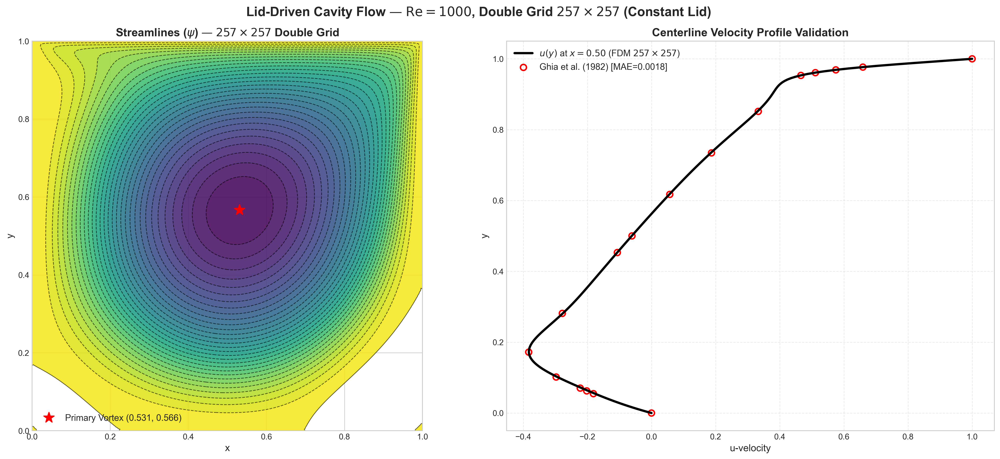

# Lid-Driven Cavity Flow Solver (2D)


[](https://doi.org/10.5281/zenodo.18312938)

High-resolution finite-difference solver for the classical 2D incompressible lid-driven cavity problem, implemented in the streamfunction–vorticity ($\psi$–$\omega$) formulation.



## Features

- **Streamfunction–Vorticity Formulation**: Automatically satisfies the incompressibility constraint ($\nabla \cdot \mathbf{u} = 0$).
- **High-Performance Poisson Engine**: Precomputed sparse direct LU decomposition (`scipy.sparse.linalg.splu`) solving the 2D streamfunction Poisson equation exact to machine precision in milliseconds per step. (Optional Red–Black SOR fallback also supported).
- **Vectorized ADI Scheme**: Alternating Direction Implicit (ADI) method with vectorized Thomas algorithm across all rows and columns simultaneously, with exact tridiagonal Dirichlet boundary closures for wall vorticity.
- **Dual Lid Profiles**:
  - `constant`: Classic benchmark lid $U(x, 1) = U$ with built-in validation against Ghia, Ghia & Shin (1982).
  - `regularized`: Singularity-free polynomial profile $u(x, 1) = 16 U (x/L)^2 (1 - x/L)^2$ eliminating corner discontinuities for analytical and Physics-Informed Neural Network (PINN) benchmarks.
- **Pressure Field Recovery**: Automated Poisson solver with homogeneous Neumann wall conditions ($\partial p/\partial n = 0$) and gauge normalization.
- **Rich Post-Processing & Export**: Full data serialization to `.npz` and `.pkl` archives with headless and interactive plotting support.

---

## Installation

Clone the repository and install the dependencies:

```bash
git clone https://github.com/KartikeyaGangwar/lid-driven-cavity-cfd.git
cd lid-driven-cavity-cfd
pip install -r requirements.txt
```

---

## Usage

### 1. Run a Simulation

**Default Ghia benchmark ($Re = 1000$, $129 \times 129$ grid):**
```bash
python lid_driven_cavity_fdm.py --N 129 --Re 1000 --lid_profile constant
```

**Regularized singularity-free lid ($Re = 1000$, $251 \times 251$ grid):**
```bash
python lid_driven_cavity_fdm.py --N 251 --Re 1000 --lid_profile regularized
```

**Headless run (suppresses GUI popup, saves figures and data):**
```bash
python lid_driven_cavity_fdm.py --N 129 --Re 100 --no_plots
```

#### Command-Line Arguments
| Flag | Type | Default | Description |
|---|---|---|---|
| `--N` | `int` | `129` | Number of grid points along each axis ($N \times N$ mesh) |
| `--Re` | `int` | `1000` | Reynolds number ($Re = UL/\nu$) |
| `--lid_profile` | `str` | `constant` | Moving lid velocity profile: `'constant'` or `'regularized'` |
| `--solver` | `str` | `lu` | Poisson solver: `'lu'` (direct sparse LU) or `'sor'` (RB-SOR) |
| `--max_iterations`| `int` | `25000`| Maximum coupling iterations |
| `--tolerance` | `float`| `1e-5` | Vorticity convergence criterion |
| `--no_plots` | `flag` | `False` | Run headlessly without opening interactive windows |

---

### 2. Plot From Precomputed Archives

Generate publication plots from any saved NumPy `.npz` archive:
```bash
python plot_from_npz.py --file flow_fields_Re1000_N251.npz
```

Headless plotting:
```bash
python plot_from_npz.py --file flow_fields_Re1000_N251.npz --no_show
```

---

## Output

1. **Flow Fields**: $(\psi, \omega, u, v, p)$ saved to both NumPy archives (`.npz`) and Python pickle dictionaries (`.pkl`) with complete coordinate grids and metadata.
2. **Diagnostic Plots**: 6-panel diagnostics displaying streamlines, vorticity, velocity magnitude, centerline velocity profiles, and pressure field.
3. **Showcase Plots**: High-contrast publication figures featuring streamline contours and centerline validation against Ghia et al. (1982).

---

## References

1. Ghia, U., Ghia, K. N., & Shin, C. T. (1982). *High-Re solutions for incompressible flow using the Navier–Stokes equations and a multigrid method*. Journal of Computational Physics, 48(3), 387–411.
2. Thom, A. (1933). *The flow past circular cylinders at low speeds*. Proceedings of the Royal Society of London. Series A, 141(845), 651–669.

---

## Related Work

- Physics-Informed Neural Network (PINN) solver for the same problem:  
  [pinn-fluid-formulations](https://github.com/KartikeyaGangwar/pinn-fluid-formulations)

---

## Citation

If you use this solver, code, or generated data in your research, please cite:

**Kartikey Singh (2026).**  
*A Reference Finite-Difference Solver for the 2D Lid-Driven Cavity Flow.*  
Zenodo. https://doi.org/10.5281/zenodo.18312938

```bibtex
@software{gangwar2026solver,
  author       = {Singh, Kartikey},
  title        = {A Reference Finite-Difference Solver for the 2D Lid-Driven Cavity Flow},
  year         = {2026},
  publisher    = {Zenodo},
  doi          = {10.5281/zenodo.18312938},
  url          = {https://doi.org/10.5281/zenodo.18312938}
}
```
